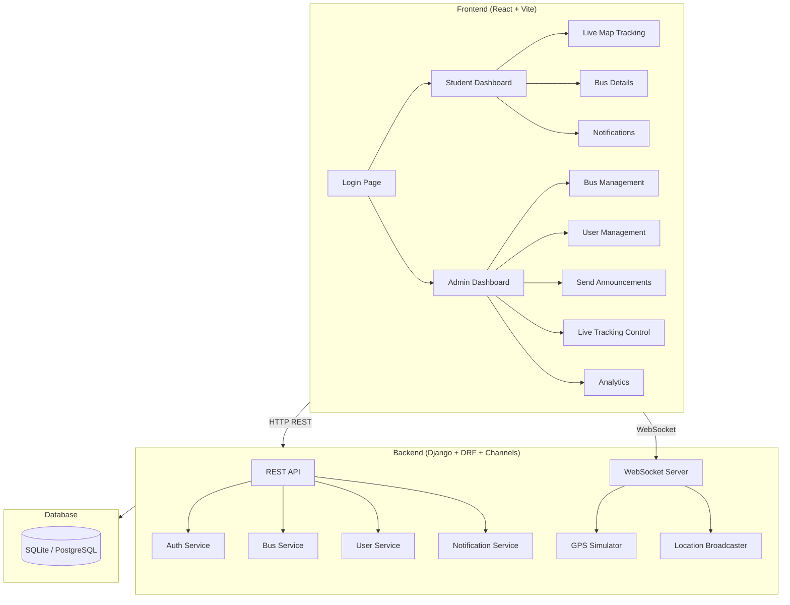
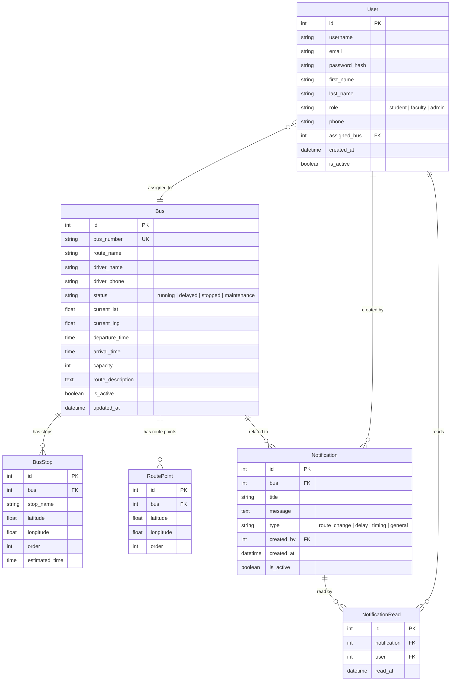

# College Bus Tracking System — Implementation Plan

## Overview

Build a production-ready **College Bus Tracking System** with:
- **Django** backend (REST API + WebSocket via Channels)
- **React** frontend (Vite + vanilla CSS glassmorphism)
- **Leaflet / OpenStreetMap** for maps (free, no API key required)
- **JWT authentication** with role-based access (Student/Faculty + Admin)
- **Real-time GPS simulation** via WebSockets
- **Apple-inspired liquid glass** design system

---

## User Review Required

> [!IMPORTANT]
> **Tech Stack Decisions** — The following choices differ slightly from the original request:
> - **Vite + React** instead of Next.js — since this is an SPA with no SSR needs, Vite is faster to develop with and simpler to deploy
> - **Vanilla CSS** (with CSS custom properties) instead of Tailwind — per workspace guidelines, unless you explicitly want Tailwind
> - **Leaflet + OpenStreetMap** instead of Google Maps / Mapbox — completely free, no API key needed, production-ready
> - **SQLite** for local development (Django default) — PostgreSQL config provided for production deployment
> - **Django Channels with Daphne** for WebSockets instead of Socket.IO

> [!WARNING]
> **GPS Simulation**: Since real GPS hardware isn't available, bus locations will be **simulated** with realistic movement along predefined routes. The system is architected so real GPS data can replace simulation trivially.

---

## Architecture



---

## Database Schema



---

## Proposed Changes

### Backend — Django Project (`backend/`)

#### [NEW] `backend/` — Django project structure

```
backend/
├── manage.py
├── requirements.txt
├── config/
│   ├── __init__.py
│   ├── settings.py           # Django settings (DB, CORS, Channels, JWT, etc.)
│   ├── urls.py                # Root URL configuration
│   ├── asgi.py                # ASGI config for Channels/Daphne
│   └── wsgi.py
├── apps/
│   ├── accounts/
│   │   ├── models.py          # Custom User model with role field
│   │   ├── serializers.py     # User registration, login, profile serializers
│   │   ├── views.py           # Login, Register, Profile, User CRUD (admin)
│   │   ├── urls.py
│   │   ├── permissions.py     # IsAdmin, IsStudentOrFaculty custom permissions
│   │   └── admin.py
│   ├── buses/
│   │   ├── models.py          # Bus, BusStop, RoutePoint models
│   │   ├── serializers.py     # Bus CRUD serializers
│   │   ├── views.py           # Bus CRUD views, search, assigned bus
│   │   ├── urls.py
│   │   └── admin.py
│   ├── notifications/
│   │   ├── models.py          # Notification, NotificationRead models
│   │   ├── serializers.py
│   │   ├── views.py           # Create/list notifications, mark read
│   │   ├── urls.py
│   │   └── admin.py
│   └── tracking/
│       ├── consumers.py       # WebSocket consumer for real-time location
│       ├── routing.py         # WebSocket URL routing
│       ├── simulator.py       # GPS simulation engine
│       └── middleware.py      # JWT WebSocket auth middleware
└── seed_data.py               # Management command to seed demo data
```

**Key API Endpoints:**

| Method | Endpoint | Description | Access |
|--------|----------|-------------|--------|
| POST | `/api/auth/login/` | JWT login | Public |
| POST | `/api/auth/register/` | Register user | Public |
| GET | `/api/auth/profile/` | Get current user profile | Authenticated |
| GET | `/api/buses/` | List all buses | Authenticated |
| GET | `/api/buses/{id}/` | Bus detail with stops | Authenticated |
| GET | `/api/buses/search/?q=` | Search by bus number | Authenticated |
| GET | `/api/buses/my-bus/` | Get assigned bus | Student/Faculty |
| POST | `/api/buses/` | Create bus | Admin |
| PUT | `/api/buses/{id}/` | Update bus | Admin |
| DELETE | `/api/buses/{id}/` | Delete bus | Admin |
| GET | `/api/users/` | List users | Admin |
| POST | `/api/users/` | Create user | Admin |
| PUT | `/api/users/{id}/` | Update user (assign bus) | Admin |
| DELETE | `/api/users/{id}/` | Delete user | Admin |
| GET | `/api/notifications/` | List notifications | Authenticated |
| POST | `/api/notifications/` | Create notification | Admin |
| POST | `/api/notifications/{id}/read/` | Mark as read | Authenticated |
| GET | `/api/analytics/` | System analytics | Admin |
| WS | `/ws/tracking/` | Real-time bus locations | Authenticated |

---

### Frontend — React App (`frontend/`)

#### [NEW] `frontend/` — Vite + React project structure

```
frontend/
├── index.html
├── package.json
├── vite.config.js
├── public/
│   └── favicon.ico
└── src/
    ├── main.jsx               # App entry point
    ├── App.jsx                # Router + auth context
    ├── index.css              # Global styles + design system tokens
    ├── api/
    │   ├── client.js          # Axios instance with JWT interceptor
    │   └── endpoints.js       # API endpoint functions
    ├── hooks/
    │   ├── useAuth.js         # Auth context hook
    │   ├── useWebSocket.js    # WebSocket connection hook
    │   └── useNotifications.js
    ├── store/
    │   └── authStore.js       # Zustand auth store
    ├── components/
    │   ├── common/
    │   │   ├── GlassCard.jsx          # Reusable glass panel
    │   │   ├── GlassButton.jsx        # Apple-style button
    │   │   ├── GlassInput.jsx         # Frosted input field
    │   │   ├── GlassModal.jsx         # Modal overlay
    │   │   ├── Sidebar.jsx            # Navigation sidebar
    │   │   ├── TopBar.jsx             # Top navigation bar
    │   │   ├── StatusBadge.jsx        # Bus status indicator
    │   │   ├── SkeletonLoader.jsx     # Loading skeleton
    │   │   ├── NotificationBell.jsx   # Notification dropdown
    │   │   ├── ThemeToggle.jsx        # Dark/light mode switch
    │   │   └── ProtectedRoute.jsx     # Auth route guard
    │   ├── map/
    │   │   ├── TrackingMap.jsx        # Leaflet map with live markers
    │   │   └── BusMarker.jsx          # Animated bus marker
    │   ├── student/
    │   │   ├── StudentDashboard.jsx   # Main student view
    │   │   ├── BusCard.jsx            # Assigned bus info card
    │   │   ├── BusSearch.jsx          # Search bus by number
    │   │   └── ETADisplay.jsx         # ETA component
    │   └── admin/
    │       ├── AdminDashboard.jsx     # Admin overview
    │       ├── BusManager.jsx         # CRUD buses
    │       ├── UserManager.jsx        # CRUD users
    │       ├── AnnouncementPanel.jsx  # Send notifications
    │       ├── TrackingControl.jsx    # GPS simulation controls
    │       └── AnalyticsPanel.jsx     # System stats
    └── pages/
        ├── LoginPage.jsx
        ├── StudentPage.jsx
        └── AdminPage.jsx
```

---

### Design System — Apple-Inspired Glassmorphism

#### Key CSS Design Tokens

```css
:root {
  /* Apple Blue */
  --accent: #007AFF;
  --accent-hover: #0056CC;

  /* Light Mode */
  --bg-primary: #f5f5f7;
  --bg-secondary: rgba(255, 255, 255, 0.72);
  --bg-glass: rgba(255, 255, 255, 0.5);
  --text-primary: #1d1d1f;
  --text-secondary: #6e6e73;
  --border-glass: rgba(255, 255, 255, 0.3);
  --shadow-glass: 0 8px 32px rgba(0, 0, 0, 0.08);
  --blur: 20px;
  --radius-sm: 12px;
  --radius-md: 16px;
  --radius-lg: 24px;

  /* Typography — SF Pro fallback */
  --font: -apple-system, BlinkMacSystemFont, 'SF Pro Display', 'Segoe UI', Roboto, sans-serif;

  /* Animation */
  --ease-apple: cubic-bezier(0.25, 0.46, 0.45, 0.94);
  --spring: cubic-bezier(0.34, 1.56, 0.64, 1);
  --duration: 0.3s;
}

[data-theme="dark"] {
  --bg-primary: #000000;
  --bg-secondary: rgba(28, 28, 30, 0.72);
  --bg-glass: rgba(44, 44, 46, 0.5);
  --text-primary: #f5f5f7;
  --text-secondary: #98989d;
  --border-glass: rgba(255, 255, 255, 0.08);
  --shadow-glass: 0 8px 32px rgba(0, 0, 0, 0.32);
}
```

#### Glass Card Component Pattern
```css
.glass-card {
  background: var(--bg-glass);
  backdrop-filter: blur(var(--blur));
  -webkit-backdrop-filter: blur(var(--blur));
  border: 1px solid var(--border-glass);
  border-radius: var(--radius-md);
  box-shadow: var(--shadow-glass);
  transition: transform var(--duration) var(--ease-apple),
              box-shadow var(--duration) var(--ease-apple);
}

.glass-card:hover {
  transform: translateY(-2px);
  box-shadow: 0 12px 40px rgba(0, 0, 0, 0.12);
}
```

---

### Seed Data & Demo

The system will ship with pre-seeded demo data:
- **3 buses** with realistic routes (simulated around a configurable campus location)
- **5 students** assigned to different buses
- **1 admin** account
- **Sample notifications** for route changes and delays
- **GPS simulation** that moves buses along predefined route points

**Default credentials:**
| Role | Username | Password |
|------|----------|----------|
| Admin | `admin` | `admin123` |
| Student | `student1` | `student123` |
| Faculty | `faculty1` | `faculty123` |

---

## Implementation Order

### Phase 1: Backend Foundation
1. Django project setup with apps structure
2. Custom User model with roles
3. Bus, BusStop, RoutePoint models
4. Notification models
5. JWT authentication (login/register/profile)
6. REST API endpoints (buses, users, notifications)
7. RBAC permissions
8. Seed data command

### Phase 2: Frontend Foundation
1. Vite + React project scaffolding
2. Design system (CSS variables, glass components)
3. Auth flow (login page, JWT storage, route guards)
4. Zustand auth store
5. API client with interceptors

### Phase 3: Student Dashboard
1. Dashboard layout (sidebar + topbar)
2. Assigned bus card with status
3. Bus search functionality
4. ETA display
5. Notification bell + dropdown

### Phase 4: Admin Dashboard
1. Admin layout
2. Bus management (CRUD table)
3. User management (CRUD + bus assignment)
4. Announcement panel
5. Analytics overview

### Phase 5: Real-Time Tracking
1. Django Channels WebSocket setup
2. GPS simulator engine
3. JWT WebSocket middleware
4. Leaflet map integration
5. Animated bus markers
6. Route path visualization

### Phase 6: Polish
1. Dark mode toggle
2. Skeleton loaders
3. Micro-animations and transitions
4. Responsive design pass
5. README documentation

---

## Open Questions

> [!IMPORTANT]
> 1. **Campus Location**: What city/campus should I center the map on for the simulated routes? (Default: I'll use a generic college campus area — Hyderabad, India)
> 2. **Number of buses**: Should I seed more than 3 demo buses?

---

## Verification Plan

### Automated Tests
- Run Django test suite for API endpoints
- Verify JWT auth flow (login → token → protected endpoint)
- Test RBAC (student can't access admin endpoints)
- WebSocket connection and message broadcasting test

### Manual Verification (Browser)
1. **Login flow**: Login as student → redirected to student dashboard
2. **Login flow**: Login as admin → redirected to admin dashboard
3. **Student dashboard**: See assigned bus, search for bus, view notifications
4. **Admin dashboard**: CRUD buses, CRUD users, send announcement
5. **Real-time map**: See bus markers moving on the map in real-time
6. **Dark mode**: Toggle works correctly across all pages
7. **Responsive**: Test on mobile viewport sizes
8. **Screenshots/recordings** of all key flows
